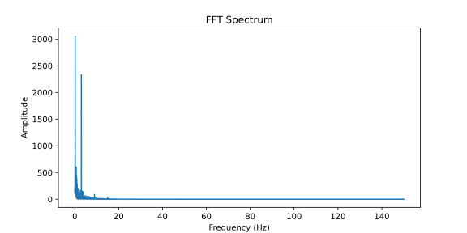
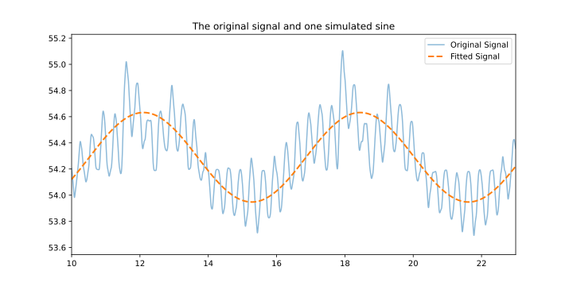
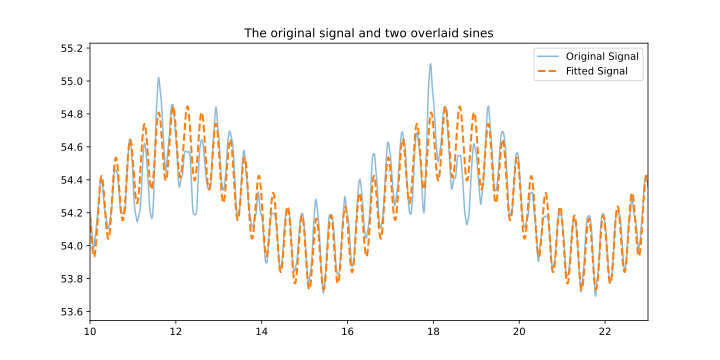
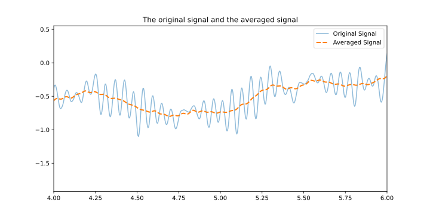
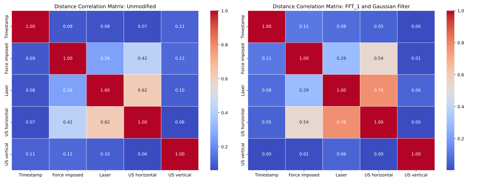
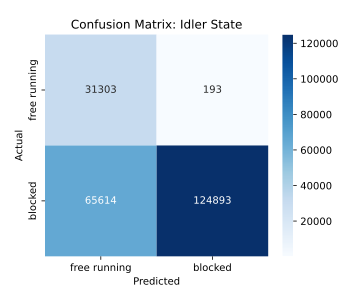

# 🚀 Machine Learning Project: Data Processing, Analysis, and Modeling

## 📋 Table of Contents
1. [Introduction](#introduction)
2. [Folder Structure](#folder-structure)
3. [Data Processing and Analysis](#data-processing-and-analysis)
4. [Machine Learning Models](#machine-learning-models)
    - [Objective 1: Weight Estimation](#weight)
    - [Objective 2: Idler State and Force position](#idler-force)
    - [Objective 3: Future Prediction](#future)
5. [Summary and Vision](#Summary)
6. [Acknowledgments](#acknowledgment)

---

Conveyer belts are the backbone of mechanical process engineering. Whenever solids are to be transported, conveyer belts are a feasible solution. These are an integral part of industry processes and usually not retundant. Therefore they must be supervised and maintained constantly. A key challenge thereby is the belt of the conveyer running off idlers due to an asymmetric load dispersion. This can lead to major mechanical damage and according shut-off times. A correction can be achieved with different passive elements. One of them is the PrimeTracker - an industry avaliable product which works passivly. It is a rubber bearing, centrally located which always wants to run horizontally. However it is able to be tilted (by the band sliding to one side). Then the PT tilts and steers the belt back into the middle position, with the same motion as front wheels of a car would.
A digital supervision and predicitve mainenance could save costs and prevent breakdowns. The idea is to include sensors into one active idler (The product Primetracker - short PT) and monitor its deflection.

For the AML Project "Conveyer Belt", data was kindly provided. The objective of the course was the data analysis, visualisation and application of machine learning algorithms. 

- **Goals:** Analyse and visualise the dataset. Futhermore build and evaluate ML models.
- **Skills Applied:** Data preprocessing, exploratory data analysis, feature engineering and machine learning.

This project is aimed to be introduced into an industrial environment. Therefore, not all the sensors avaliable in the lab can be realised. This results in a focus on the US-sensors and the Reed Sensors, as these can be built neatly into the PT itself in an industrial application. All the other sensors are only used for model training (e.g Force Imposed) or neglected (e.g Laser). 
 

### 📁 Folder Descriptions 

- **`data/`**: Contains raw datasets. These have been renamed.
- **`Graveyard/`**: Not used and dropped approaches
- **`Pics/`**: Stores photos for the README
- **`README.md`**: Overview of the project, instructions, and documentation.

Futhermore, all the nessecery data, notebooks and scripts can be found in the main folder.  

---

### Data Processing and Analysis: Exploratory Data Analysis (EDA) 📊 
> 📂 **Note:** All the steps introduced in this chapter are performend in the Data_set_build.ipynb Notebook

Following data was collected:
| Sensor Description                     | Sensor Type        |
|----------------------------------------|--------------------|
| x-Deflection                           | Ultrasonic        |
| y-Deflection                           | Ultrasonic        |
| Belt velocity Motor                    | 2 m/s setting     |
| Belt velocity Sensor per belt revolution | Contrast sensor   |
| Belt velocity Sensor per idler revolution | Magnet Sensor    |
| Belt alignment                         | Laser sensor      |
| Force Sensor Test Device               | Force Sensor      |

### 🔍 Data Processing and Analysis
The data was provided in a very rudimentary folder structure and with a lot of cleaning effort to be undertaken. Exemplaric, (,) instead of (.) separators were used. Futhermore was every data column next to its separate time column and the file naming was not cohesive.
Therefore, a consistent .csv data name structure was built. This was done manually and the renamed files are povided in this Git Repository.
The naming of the file follows the logic:
| Code  | Example | Description                                      |
|-------|---------|--------------------------------------------------|
| xxx   | 010     | Identifier Number                               |
| x     | l       | (l)ab or (o)utside world                        |
| xxxN  | 100N    | Force applied                                   |
| xx    | rl      | Rücklauf (rl) after or force applied (fa)       |
| x     | r       | Position of applied force (left/right/unknown)  |
| x     | e       | Position Force on idler: (e)xcentric, (f)ree spinning, (b)locked idler, (u)nknown |
| rep   |         | Repetition                                      |

In order for the data being processable, the values got merged into a standard format by a custom program:
> 📂 **Note:** The custom merging_data_to_uniform_layout.py script processes the data accordingly and returns a datafile in the following format:

| Timestamp   | Force Imposed     | Laser          | US Horizontal  | US Vertical    | Belt Revolution | PT Revolution |
|-------------|-------------------|----------------|----------------|----------------|-----------------|---------------|
| 2.862588197 | -1.377794981003  | 71.73274230957 | 54.14170074463 | 57.50838851929 | 23.19651412964  | -             |
| 2.865920663 | -1.432598829269  | 71.73104095459 | 54.14140701294 | 57.47575378418 | 23.19651412964  | -             |
| 2.869253129 | -1.480222344399  | 71.72911071777 | 54.14151382446 | 57.44061660767 | 23.19651603700  | -0.263725281  |
    
It can be obtained that the category "PT Revolution" was collected only every third datapoint. This has to be taken into account later.

The following picture shows a random timespan and according plots:

**Explanation of the Data**
 - Force Imposed: In order to simulate an uneven load dispersion, the belt gets a force input by a wheel which gets presssed on one side of the belt. The according force on the belt is measured.
 - A laser measures the offset of the band to its center position on the idler. This sensor is only avaliable in a lab environment and thus not further used in the project.
 - The ultrasonic sensors (US) measure the deflection of the PT in horizontal and vertical axis.
 - The belt revolution sensor is an optical sensor indicating every revolution of the belt. This data is also not used.
 - A reed switch measures two ticks per PT Revolution, as two sensors are mounted inside the PT.

### 🛠 Data Cleaning
In some data, the logging was started prior to the conveyer belt or stopped after the conveyer belt itself stopped. Thus the transient startup behavior is part of the data set. These effects however shall not be used for ML training, further has to be detected and cut. This is performed in the detecting_startstop_behaviour.py program on the basis of the statistic duration between ticks. Both ends of the file are cut until the tick duration is in the [0.2, 0.8] quantile.

> 📂 **Note:** The custom detecting_startstop_behaviour.py script processes the data accordingly. It is also used within the previously introduced merging_data_to_uniform_layout.py. Following is this script a one-stop-solution. A raw input .csv file can be fed and the progam will return a ready to work with and standardised datafile.

> 🔧 **Future Perspective:** The cutting of data could also be handeled by a ML Model and easily implemented into the script at a later project stage.
  
Summarised, the given .csv files can just be fed through merging_data_to_uniform_layout.py and will be returned as a easy to work with dataframes.

### Noise and Smoothing of the Ultrasonic Sensors
Looking at the output of the US-Sensors, roughly two overlaid sine courves can be observed. These can furthermore be proven via an Fast Fourier Transformation. This is an operation which splits a function in a sum of sublying frequencies. Two dominant frequencies then can be seen in the FFT-Spectrum.

The two sines can be easily explained from the lab setup. The higher frequent sine represents every revolution of the PT itself, as minor defects in production causes minimal irregularities in the round shape. The slower frequent sine represents one total belt revolution. This finding enables three depths of data quality:

 - Using the originally recorded data, with possibly some filtering to avoid outliers. This results in the least data loss, however comes with a lot of noise. This might come into effect when even small derivations are relevant.
 - Using the artificial two-sine signal as a clean, close to reality approximation.
 - Using only the slower frequent sine as the overall belt rotation as the most reduced solution.

Summarising can the output signal of the US-Sensors can be approximated by a clean, artificial signal which still includes the relevant information.

The US-Sensors can so be modeled into artificial data courves only containing relevant information. 

### Noise and Smoothing of the Force Imposed
This function smoothes the Force imposed measurements. As in the training, this will be the target values. Therefore things shall be kept simple. As the force is introduced onto the belt via a wheel, every revolution of the wheel can be found in the measuring data again. This however is not relevant to the model and thus shall vanish.
As a first try, this was performed with a moving average procedure. The output signal however was still too noisy. Therefore a gaussian filter was implemented.

### Finding Correlations, Feature Selection
Distance correlation is a statistical measure that captures both linear and nonlinear relationships between variables, unlike Pearson correlation, which only detects linear dependencies. A value of 1 indicates a perfect dependence, while a value of 0 suggests no statistical relationship.

In the umodified matrix, including all data without filtering or smoothing procedures, US horizontal has a moderate correlation with Force imposed (0.423), suggesting that the applied force has a noticeable effect on the horizontal ultrasonic signal, which is going to be used to train a ML-Model. Additionally, US horizontal is strongly correlated with Laser (0.623), which, in an industrial application, will not be avaliable and thus shall not be further used.

On the other hand, US vertical shows weak correlations with all variables, including Force imposed (0.125) and US horizontal (0.062), suggesting that the imposed force primarily affects the horizontal component rather than the vertical one.

However it is of interest, how the smoothing procedures introduced previously effects the correlation. Therefore the most-smoothed and a non-smoothed distance correlation matrix are presented next to eachother:

Less noisy data can lead to better correlation by reducing random variability, improving signal detection. Noise distorts true relationships, weakening both linear (Pearson) and rank-based (Spearman) correlations. By minimizing noise, data points can align more closely with the actual trend, resulting in a stronger and more accurate correlation. However, the loss of information can also weaken a correlation, as it can be obtained between the two US Sensors. The overall trends however withstand the smoothing procedures.

Another correlation of interest exists between the idler state, position of the force imposed and the sensor data. Therefore, another correlation plot is created:

In the distance correlation matrix, US horizontal and US vertical after treatment with FFT_2 exhibit a strong correlation (0.897), prooving they are closely related, as they are representing components of a closely bound source of motion. Position shows a moderate correlation with US horizontal (0.745) and US vertical (0.656), indicating that it is influenced by these variables but not in a strictly linear manner. The Idler variable has weak correlations with all other variables, with its highest correlation being with US horizontal (0.222), suggesting it is largely independent. It is to be seen if a ML-Model is able to detect the correlation regarding.

### 🏗️ Building the dataset
As mentioned,  following information is found in the file name
* Force applied position: left (-1) to right (1)
* Idler state: blocked (1), free running/excentric (0)
* Force applied (This can also be found as a precise measurement)
* Field or lab data

The whole database can then be rearranged undergoing these criteria and combined to a new datafile in order for training a specific ML-Model

**Regression for Weight approximation**

The only relevant columns are:
 - Timestamp
 - Force Imposed (gaussian smoothed)
 - US horizontal (fft: only main frequency)

A seperate .csv file is created and stored under the name: db_reg_fft_2.csv
The other data is not collected for efficiency reasons.

**Classification for Weight approximation**

The only relevant columns are:
 - Timestamp
 - Value provided from the experiment in the file name
 - US horizontal (fft: only main frequency)

A seperate .csv file is created and stored under the name: db_class_fft_2.csv
The other data is not collected for efficiency reasons.

**Regression for Idler State and Force Position**

In order to assess correlations between the idler state, force imput and the US-Sensors, another correlation plot will be established. To do so, the information found in the filename is added into the databases.
The relevant columns are:
 - Timestamp
 - Position and idler state provided from the experiment
 - US horizontal (fft: only main frequency)
 - US vertical (fft: only main frequency) The other data is not collected for efficiency reasons
A seperate .csv file is created and stored under the name: db_idler_fft_2.csv
The other data is not collected for efficiency reasons.

**Gaussian Process and Data Lagging for Future Prediction**

The only relevant columns are:

 - US Sensor horizontal (fft_2)
 - US Sensor vertical (fft_2)

For testing reasons, only one datasheet will be used for now.
A seperate .csv file is created and stored under the name: db_fut_X.csv
The other data is not collected for efficiency reasons.

> 📂 **Note:** The Data_lagging.py script performs the lagging accordingly. A dataframe will be turned into according arrays.
> 
The goal is to represent past values ("History") into current value, as ML models in the sklearn library don´t provide any memory functionality (looped kernel structure). Therefore, the sensor data is "lagged", as exemplaric shown in the plot below:

| Timestamp | Sensor1_lag2 | Sensor2_lag2 | Sensor1_lag1 | Sensor2_lag2 | y_1  |  y_2  | 
|:-------:|:---------:|:---------:|:---------:|:---------:|:-------:|:-------:|
|  0.01   |   NaN   |   NaN   |   NaN   |   NaN   |   1   |  3  |
|  0.02   |   NaN   |   NaN   |   1   |   3   |   11   |  33  |
|  0.03   |   1   |   3   |   11   |   33   |   111   |  333  |
|  0.04   |   11   |   33   |   111   |   333   |   1111   |  3333  |

---

## 🤖 Machine Learning Models

> 🔧 **Future Perspective:** All the presented ML-Models are in an early development stage. A lot of hyperparameter finetuning, kernel design adaptions and better training data can improve results significantly. In order to keep the training duration short, the models were trained with relatively low data amounts by setting the split of test and train data in "train_test_split" accordingly. Furthermore was the training data of reduced variety by only including a limited amount of initial measurements. These constraints shall be reduced in subsequent research.

With the previously built databases, ML-Models can be trained. Therefore three objectives were followed.

### Objective: Weight Approximation

> 📂 **Note:** All the models introduced in this section can be found in the Weight_estimation.ipynb Notebook

- **Objective:** Classifying the weight on the belt with the horizontal US-Sensor
- **Algorithms Used:** Decision Tree, MLP
- **Performance Metrics:** Accuracy, F1 Score (Precision and Recall)

**Desicion Tree**
A Decision Tree is a supervised machine learning model used for classification and regression tasks. It works by recursively splitting the data into subsets based on feature values, forming a tree-like structure where each internal node represents a decision based on a feature, branches indicate outcomes, and leaf nodes contain the final prediction.
It can be obtained from the Confusion Matrix, that the trained desicion tree works best when the actual weight is 0. Thus it was of interest, where this is coming from. The overall input data thus was looked at again, interested in which of the weight values the model was trained with most:

It can be seen that the model was trained with an inbalance of classes. This could be handeled by the argument "class_weight="balanced", which forces the training of the model with a balanced class distribution. This subsequently should improve the overall model performance

**MLP**

A Multi-Layer Perceptron (MLP) is a type of artificial neural network used for supervised learning tasks, including classification and regression. It consists of an input layer, one or more hidden layers, and an output layer. Each layer is made up of neurons that apply weighted sums and activation functions (e.g., ReLU, Sigmoid) to transform inputs and learn complex patterns.

MLPs excel at capturing non-linear relationships and are trained using backpropagation and optimization techniques like stochastic gradient descent (SGD), as performed in this project.

**Comparison of the Classifies**

The Decision Tree model achieves a higher overall accuracy (0.736) compared to MLP’s 0.608, indicating it makes more correct predictions overall. It also performs better in terms of macro average precision (0.739 vs. 0.573) and weighted average F1-score (0.719 vs. 0.577), showing stronger classification ability across different classes.

However, MLP exhibits higher recall for class 0 (0.946 vs. 0.710), meaning it captures more actual instances of that class. Yet, its performance on other classes is weaker, with particularly low recall for class 50 (0.187), suggesting MLP struggles to correctly identify certain categories, expecially in low weight scenarios.

Overall, the Decision Tree outperforms MLP in balanced classification, whereas MLP shows strong recall in certain cases but struggles with precision and consistency across classes. This suggests that the Decision Tree is the better choice for this dataset unless additional tuning improves MLP's generalization.

- **Objective:** Predict a continuous weight value variable as a regression Problem
- **Algorithm Used:** SVC Regressor
- **Performance Metrics:** R² Score

Support Vector Regression (SVR) is a machine learning model based on Support Vector Machines (SVM), designed for regression tasks. It focuses on generalization by finding a hyperplane that maximizes the margin while keeping errors within a defined threshold.  They can be computationally expensive for large datasets, which forced to reduce the training dataset heavily during optimisation.

The model was trained on a set of 14,146 data points and achieved a best validation accuracy of 0.85, indicating strong generalization to unseen data. It's R²-score on the test data is 0.85, which confirms that it explains 85% of the variance in the test set. This indicates a good fit and high predictive performance on new, unseen data. Overall, the model demonstrates solid performance with good generalization, suggesting that the chosen hyperparameters and model configuration were well-suited for the given regression task.

### Objective: Weight position and Idler State Classification

> 📂 **Note:** All the models introduced in this section can be found in the Idler_Position_estimation.ipynb Notebook
> 
- **Objective:** Predict the side of the introduced weight as well as detecting a blocked idler
- **Algorithm Used:** Random Forrest, MLP Multilabel
- **Performance Metrics:** R² Score.

**Random Forrest**

Random Forest is an ensemble machine learning algorithm used for both classification and regression tasks. It builds multiple decision trees during training and combines their outputs to improve accuracy and reduce overfitting. Each tree is trained on a random subset of the data and features, ensuring diversity in predictions.

As Random Forrests don´t initially support multilabel data, two Random Forrests were trained separatly on each label. The according Confusion Matrices are presented here, a summay can be found over all the Classifiers.

**MLP**

The MLP model was able to predict multilabel classes and their relation to eachother and therefore can predict both labels simultaniously.

**Comparison of the Classifies**

The Random Forest for Position Classification achieves high accuracy (0.925), with strong precision and recall scores for both classes. The macro (0.925) and weighted averages (0.925) further confirm its consistent performance across different categories. This suggests that this Random Forest is well-suited for predicting position data, offering a balanced and reliable classification.

The Random Forest for Idler State Classification performs moderately well, with an accuracy of 0.704. However, its class-wise performance varies significantly: class "free running" has high recall (0.994) but low precision (0.323), while class "blocked" has high precision (0.998) but lower recall (0.656). This imbalance indicates potential bias in classification, where one class is favored over the other - a indicater to overfitting.

MLP Multilabel Classification shows strong overall performance, with an accuracy of 0.915 and weighted F1-score of 0.930. It achieves the highest scores in recall and precision across labels, suggesting better generalization and robustness for multilabel classification tasks compared to Random Forest models. It must be ephasized however that all models have undergone only basic hyperparameter tuning and training, thus significant performance leaps could be archived.

### Objective: Predicting future behaviour

> 📂 **Note:** All the models introduced in this section can be found in the Future_behaviour_GP.ipynb Notebook

> 🔧 **Future Perspective:** Due to time constraints, this model was taken care of the least. It still is work in progress and lacks of training data as well as optimisation. However it is still a very interesting objective and thus shall be presented here. 

- **Objective:** Predict the future of the US-Sensors
- **Algorithm Used:** Gaussian Process
- **Performance Metrics:** Mean Squared Error (MSE), R² Score.

**Gaussian Process**

A Gaussian Process (GP) is a machine learning model used for regression and classification tasks. It provides a probabilistic approach to learning, meaning it not only predicts values but also quantifies uncertainty in its predictions. It is also a computaional heavy model. 
The model could be especially of use, when sensor data runs our of uncertainty borders indicating an emergency and triggering an emergency stop, eg of the conveyer belt. 

The Gaussian Process (GP) model delivered "exceptional performance", achieving an R²-score of 1.00 on the test data with an 80% test split, when only trained on one initial dataset. This indicates a perfect fit, meaning the model explains 100% of the variance in the dataset. Additionally, the Mean Squared Error (MSE) is extremely low (≈2.83e-13), suggesting that the predicted values are nearly identical to the actual values.

These results indicate overfitting, especially as the training data is limited. This perfect score suggests that the model might be memorizing the training data rather than learning generalizable patterns. Better training data should be used.

It was tried to predict the future behaviour of the US-Sensors, with no great success. The strategy was a loop for predicting the next datapoint out of the previous ones expanding into the future.
A prediction was able to be generated, however with no noticeable uncertainty borders and poor correlation to the actual signal.

### Overfitting prevention strategies

To avoid overfitting, two main strategies were employed: limiting the dataset size and using k-fold cross-validation with 3 to 5 folds. The reduced data amount helped control model complexity, while k-fold cross-validation ensured better generalization by training and validating the model on multiple subsets. By varying the number of folds, computational heavy models could be trained in a more efficient way, but overall still reducing the risk of overfitting while maintaining reliable performance.

In the Gaussian Process, due to the relatively uniform dataset, overfitting could be observed. A more diverse databasis by including multiple initial measurements will reduce the risk of overfitting resulting in better predictions. 

---

## Summary and Vision 

Conveyor belts are essential in mechanical process engineering, providing a reliable method for transporting solids across industrial plants and processes. Since they are typically non-redundant, continuous monitoring and maintenance are crucial to prevent failures. One of the key challenges is the misalignment of belts due to asymmetric load distribution, which can cause severe mechanical damage and production downtime. Passive correction mechanisms, such as the PrimeTracker (PT), help realign the belt by tilting and steering it back to its central position, similar to the movement of car front wheels. Furthermore, broken idlers can cause siginficant damage to the belt itself and structures around.

To enhance digital supervision and predictive maintenance, a monitoring system was proposed by integrating sensors into an active idler (PT) to track its deflection. Multiple machine learning models were evaluated to predict the system’s state as well as weight estimation:

 - Decision Trees: Performed well for weight estimation with an overall accuracy of 0.736, showing a good balance between precision and recall.
 - Support Vector Regression (SVR): Achieved an R²-score of 0.85, demonstrating strong predictive capabilities. The best validation accuracy was also 0.85, with hyperparameters favoring an RBF kernel and a high C value (500) for precise fitting.
 - Random Forest Models: Used for position classification (RF1) and idler state classification (RF2). RF1 performed well (accuracy = 0.925), making it reliable for tracking position. RF2, however, struggled with class imbalance or overfitting, leading to lower accuracy (0.704), especially in predicting the idler state.
 - Multi-Layer Perceptron (MLP): Outperformed RF2 in multilabel classification, achieving an accuracy of 0.915 and a weighted F1-score of 0.930, making it a robust choice for scenarios requiring complex decision-making across multiple labels. Furthermore delivered the MLP promising results for weight estimation.

To combat overfitting, strategies included limiting dataset size and using k-fold cross-validation (3 to 5 folds) to balance computational efficiency and generalization.

**Conclusion**

The study demonstrates that machine learning can effectively support predictive maintenance for conveyor belt systems, particularly when monitoring the PrimeTracker’s behavior. Random Forest is well-suited for structured classification tasks, while MLP performs better in multilabel classification scenarios. SVR provided strong regression performance, making it a viable choice for continuous state estimation. Improvements have to be made with according training data, kernel optimisation and data variety. The according scripts and programs are already capable and ready to do so, however due to computational and time limitations, bigger training datasets weren´t built. Futhermore, subsequent reserach could focus on data balancing, sensor optimization, and real-time implementation to enhance prediction accuracy and reliability.

## Acknowledgement 👏

I want to thank the Institute for Cyberphysical Systems at Montanuniversität Leoben for the interesting couse and first insights into Machine Learning. Furthermore provided the Institute of Bergbaukunde the datasets and practical application.
